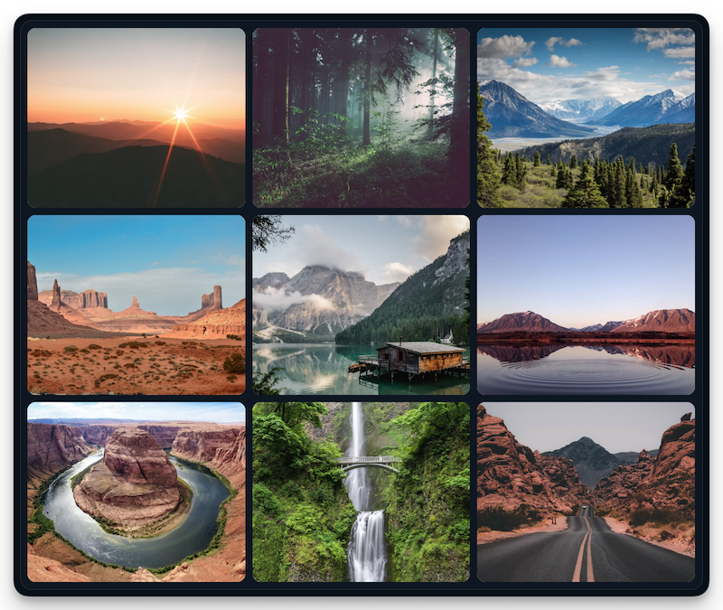

# react-pic-gallery

Small, accessible React image gallery and lightbox with a polished default UI and typed escape hatches for custom controls.

[](https://www.npmjs.com/package/react-pic-gallery)
[](https://bundlephobia.com/package/react-pic-gallery)

[Live playground and docs](https://marcelrsoub.github.io/react-pic-gallery/)



## Install

```bash
npm install react-pic-gallery
```

```bash
pnpm add react-pic-gallery
yarn add react-pic-gallery
bun add react-pic-gallery
```

React 18.3+ and React 19 are supported. The [Quick start docs](https://marcelrsoub.github.io/react-pic-gallery/docs/getting-started/) provide these commands in a package-manager switcher.

The package is intentionally lightweight: it has no runtime dependencies and React is a peer dependency. The built JavaScript and CSS together are about **9.6 KB gzipped** (7.20 KB JS + 2.40 KB CSS).

## Why react-pic-gallery

- **Tiny by design**: no runtime dependencies, no context providers, no polyfills; ~9.6 KB gzipped total.
- **Simple by default**: one component, one stylesheet import, sensible accessible defaults.
- **Yours when needed**: typed `renderActions`, `renderCaption`, and `renderControls` callbacks let you add custom UI without rebuilding the lightbox; extra fields on your image objects flow through fully typed.
- **Accessible**: native modal `<dialog>`, focus containment and restoration, Escape to close, screen-reader announcements, `prefers-reduced-motion` support.
- **Keyboard and touch friendly**: arrow-key navigation in the grid (roving tabindex) and in the lightbox, Enter to open, swipe navigation on touch devices.
- **Themeable**: namespaced classes and CSS variables (`--gallery-accent`, `--gallery-overlay`, `--gallery-motion`, …).
- **Four layouts**: choose a uniform grid, proportional justified rows, an editorial mosaic, or an inline carousel.

## Quick start

```tsx
import { PicGallery } from 'react-pic-gallery'
import 'react-pic-gallery/styles.css'

const images = [
  {
    src: 'https://example.com/mountain.jpg',
    alt: 'A mountain reflected in a lake',
    caption: 'Morning at the lake'
  }
]

export function App() {
  return <PicGallery images={images} />
}
```

`src` and `alt` are required; `id`, `caption`, `width`, and `height` are optional. Image objects can include application-specific fields; those remain available in renderer callbacks when using TypeScript generics.

## Responsive images

`src` alone is enough to start. When you have multiple sizes, add native `srcSet` and `sizes` for the full-size image and optionally a separate thumbnail family:

```tsx
const images = [
  {
    src: 'https://example.com/mountain-1600.jpg',
    srcSet: 'https://example.com/mountain-960.jpg 960w, https://example.com/mountain-1600.jpg 1600w',
    sizes: '(max-width: 48rem) 100vw, 80rem',
    thumbnailSrc: 'https://example.com/mountain-thumb-480.jpg',
    thumbnailSrcSet: 'https://example.com/mountain-thumb-320.jpg 320w, https://example.com/mountain-thumb-640.jpg 640w',
    thumbnailSizes: '(max-width: 48rem) 100vw, 33vw',
    alt: 'A mountain reflected in a lake'
  }
]
```

A dedicated thumbnail family is used when either `thumbnailSrc` or `thumbnailSrcSet` is set; if only `thumbnailSrcSet` is set, `src` is its fallback URL. Otherwise thumbnails reuse `src`, `srcSet`, and `sizes`, so you can omit thumbnails entirely. `sizes` is optional, but accurate values let the browser avoid downloading larger candidates than needed.

## Gallery layouts

The default is the existing three-column grid. Choose another layout with `layout`:

```tsx
<PicGallery images={images} layout='justified' />
<PicGallery images={images} layout='mosaic' />
<PicGallery images={images} layout='carousel' />
```

- **`grid`**: consistent tiles with a configurable fixed column count.
- **`justified`**: proportional photos arranged in aligned rows; the final row stays left-aligned.
- **`mosaic`**: alternating featured photos and smaller supporting tiles.
- **`carousel`**: one image at a time with inline previous/next controls.

The default appearance is `framed`; use `appearance='bare'` to remove the outer surface while retaining tile spacing and rounded corners. Image `width` and `height` are recommended, but optional. Justified rows use them when supplied and fall back to 3:2 when either dimension is missing or invalid. Accurate dimensions give the most faithful layout and help reserve space while images load. `rowHeight` sets the tile height for the grid, the base row height for the mosaic, and the target row height for justified galleries. `columns` applies to the grid only and defaults to three.

## Custom UI

Add actions without rebuilding the lightbox:

```tsx
<PicGallery
  images={images}
  renderActions={({ image }) => (
    <button type='button' onClick={() => saveImage(image)}>
      Save
    </button>
  )}
/>
```

Every renderer receives:

```ts
{
  image,
  index,
  count,
  close,
  next,
  previous,
  canGoNext,
  canGoPrevious
}
```

Use `renderCaption` to replace the caption, or `renderControls` to replace the complete default control layer. When `renderControls` is provided, your controls are responsible for rendering close and navigation actions.

## Standalone components

Use the thumbnail grid and lightbox separately when your application owns selection state:

```tsx
import { useState } from 'react'
import { Gallery, Lightbox } from 'react-pic-gallery'

export function CustomViewer({ images }) {
  const [index, setIndex] = useState<number | null>(null)

  return (
    <>
      <Gallery images={images} onImageClick={setIndex} />
      <Lightbox images={images} index={index} onIndexChange={setIndex} />
    </>
  )
}
```

## Lightbox behavior

The lightbox uses the native modal `<dialog>` element and includes:

- Keyboard navigation, Escape-to-close, focus containment, and focus restoration.
- Backdrop closing with stable page width while scrolling is locked.
- Native lazy loading for thumbnails and explicit image loading/error states.
- Adjacent full-size images are preloaded while the viewer is active, using responsive sources and low fetch priority.
- Horizontal swipe navigation on touch devices.
- Instagram-Stories-style edge taps on touch screens: tap the right edge of the image to go forward, the left edge to go back (navigation buttons are hidden on small screens where tap zones take over).
- Reduced-motion support, safe-area padding, rounded image surfaces, and animated transitions.

Gallery tiles use roving focus. Left/Right follow image order; in the grid, Up/Down jump a row, and in justified and mosaic layouts they follow the nearest tile position. Home/End move to the first/last image. Enter opens the lightbox, and focus returns to the same tile when it closes.

Native modal behavior targets modern browsers: Chrome 37+, Edge 79+, Firefox 98+, and Safari/iOS 15.4+. The package does not ship a dialog polyfill.

Adjacent preloading is enabled by default and considers only the immediate previous and next full-size images while the lightbox is open or the inline carousel is mounted. The shared tracker is capped at 32 entries. Set `preloadAdjacent={false}` to opt out. It uses the browser image cache and does not guarantee reuse; cache headers, browser policy, and network conditions still apply.

## Styling

The stylesheet uses namespaced classes and CSS variables. Import it once. **No variable is required**. Every one ships with a default, so override only what you need.

```css
.brand-gallery {
  --gallery-accent: #ff7a59;
}
```

```tsx
<PicGallery className='brand-gallery' images={images} />
```

Set gallery variables on the `PicGallery` wrapper (for example through its `className`) so the layout container inherits them. The lightbox is portaled, so lightbox variables must be set globally or on `.react-pic-gallery__lightbox`. The default appearance is `framed`; set `appearance='bare'` to remove the frame surface while keeping the tile gap and tile radius.

| Variable | Default | Scope | Purpose |
| --- | --- | --- | --- |
| `--gallery-background` | `#111a24` | Gallery | Framed gallery surface color. |
| `--gallery-padding` | `0.65rem` | Gallery | Space inside the frame around the tiles. |
| `--gallery-border` | `1px solid rgba(148, 163, 184, 0.18)` | Gallery | Frame border. |
| `--gallery-frame-radius` | `1.1rem` | Gallery | Outer frame corner radius; separate from tile radius. |
| `--gallery-gap` | `0.75rem` | Gallery | Space between gallery tiles. |
| `--gallery-radius` | `1rem` | Gallery | Tile corner radius. |
| `--gallery-row-height` | `12rem` | Gallery | Tile/base mosaic row height, or target justified-row height, when `rowHeight` is not supplied. |
| `--gallery-accent` | `#9ef01a` | Both | Focus ring, loader, and interactive accent color. |
| `--gallery-carousel-height` | `24rem` | Gallery | Height of the inline carousel (`14rem` at screen widths up to `600px`). |
| `--gallery-motion` | `180ms` | Both | Transition and animation duration. |
| `--gallery-overlay` | `rgba(7, 11, 16, 0.94)` | Lightbox | Lightbox backdrop color. |
| `--gallery-control-size` | `2.75rem` | Lightbox | Close and navigation target size. |

The default grid uses three columns. Pass `columns` for a different fixed count. `rowHeight` accepts CSS height values or numeric pixels; its meaning depends on the selected layout as described above.

## API

### `PicGallery`

| Prop | Type | Description |
| --- | --- | --- |
| `images` | `readonly GalleryImage[]` | Images to display. |
| `layout` | `'grid' \| 'justified' \| 'mosaic' \| 'carousel'` | Defaults to `'grid'`. |
| `appearance` | `'framed' \| 'bare'` | Defaults to `'framed'`. |
| `columns` | `number` | Optional fixed grid column count. Defaults to three; only applies to `grid`. |
| `rowHeight` | `CSSProperties['height']` | Grid tile height, mosaic base row height, or justified target row height. |
| `preloadAdjacent` | `boolean` | Defaults to `true`. Preloads adjacent full-size images while the lightbox is open, and for the inline carousel while it is mounted. |
| `renderActions` | `LightboxRenderer` | Adds controls to the default toolbar. |
| `renderCaption` | `LightboxRenderer` | Replaces the current caption. |
| `renderControls` | `LightboxRenderer` | Replaces the complete default control layer. |
| `showCounter` | `boolean` | Shows the current image count. Defaults to `true`. |
| `showNavigation` | `boolean` | Shows previous/next controls. Defaults to `true`. |

`Gallery` accepts `images`, `onImageClick`, `layout`, `appearance`, `columns`, `rowHeight`, `preloadAdjacent`, `className`, and `style`. Its appearance defaults to `framed`; adjacent-image preloading applies only when `layout='carousel'`.

`Lightbox` accepts `images`, controlled `index`, `onIndexChange`, the renderer props, `showCounter`, `showNavigation`, `preloadAdjacent`, and `className`.

`PicGallery` accepts `appearance` (`'framed' | 'bare'`, default `'framed'`) and `preloadAdjacent` in addition to the props above. Adjacent preloading is enabled by default while the lightbox is open or the inline carousel is mounted. It preloads only the immediate previous and next full-size responsive sources, uses low fetch priority, and tracks at most 32 preload entries. Set `preloadAdjacent={false}` to opt out. Browser caching and network policy determine whether a prefetched response is reused.

### `GalleryImage`

| Field | Type | Description |
| --- | --- | --- |
| `src` | `string` | Required full-size fallback source. |
| `srcSet` | `string` | Optional responsive full-size candidates, passed to the browser natively. |
| `sizes` | `string` | Optional rendered-size hint for `srcSet`. |
| `thumbnailSrc` | `string` | Optional dedicated thumbnail source. |
| `thumbnailSrcSet` | `string` | Optional responsive candidates for a dedicated thumbnail family. |
| `thumbnailSizes` | `string` | Optional rendered-size hint for `thumbnailSrcSet`. |

## Migrating from v1

v2 intentionally removes the old configuration and external lightbox workaround.

`Gallery` and `PicGallery` now use the built-in framed appearance by default. If an existing card or `.gallery-frame` wrapper adds its own padding, background, border, or rounded surface, remove those duplicate surface styles and keep only layout or margin rules. Set `appearance='bare'` when you want the previous unframed look; tile spacing and tile corner radii remain in place.

| v1 | v2 |
| --- | --- |
| `imgList` | `images` |
| `fullSrc` | `src` |
| `thumbnailSrc` | `thumbnailSrc` |
| `description` | `caption` |
| default import | named `PicGallery` import (default import remains available) |
| `options.picsPerRow` | `columns` |
| `options.rowHeight` | `rowHeight` |
| `topCustomContent` / `bottomCustomContent` | `renderActions`, `renderCaption`, or `renderControls` |
| `externalLightbox` / `setExtLightboxChildren` | controlled `Lightbox` |
| `customLoadComponent` | CSS overrides or your own `Gallery` composition |
| `react-zoom-pan-pinch` | removed dependency; native lightbox pinch zoom |

Before:

```tsx
<PicGallery
  imgList={[{ fullSrc, thumbnailSrc }]}
  options={{ picsPerRow: 4 }}
/>
```

After:

```tsx
<PicGallery
  images={[{ src: fullSrc, thumbnailSrc, alt: 'Description' }]}
  columns={4}
/>
```

The package is ESM-only in v2. Import `styles.css` explicitly in applications that do not automatically process CSS imported by JavaScript.

## Development

Node 22.12+ is required for the Astro documentation workflow.

```bash
npm install
npm run dev
npm run dev:library
npm test
npm run test:visual
npm run typecheck
npm run build
npm run build:docs
npm pack --dry-run
```

`npm run dev` starts the Astro playground and docs site. `npm run dev:library` starts the standalone Vite library demo. Publishing runs the package build automatically through `prepack`.

### Visual regression tests

`npm run test:visual` renders a deterministic fixture (`visual/`) across every layout, the standalone components, and the lightbox at desktop and mobile widths, then compares screenshots and layout metrics against the committed baselines in `visual/baselines/`. `npm run test:visual:update` regenerates those baselines after an intentional visual change.

The harness drives a real Chromium over the DevTools protocol, so a browser must be reachable. It defaults to `ws://127.0.0.1:9222/`; override with `VISUAL_CDP`. In this repository's environment, run the browserless Chromium container and set `VISUAL_BASE_HOST` to the host address the container can reach (the container's default gateway, e.g. `192.168.16.1`):

```bash
VISUAL_BASE_HOST=192.168.16.1 npm run test:visual
```

`npm run test:visual:cross` renders the current working tree and a prior git ref with the `bare` appearance, which matches the pre-`framed` default, and diffs them to confirm rendering did not change. It accepts `--ref <ref>` (default `HEAD`) and `--tolerance <ratio>` (default `0.0005`, i.e. 0.05% of pixels) for sub-pixel text antialiasing:

```bash
VISUAL_BASE_HOST=192.168.16.1 npm run test:visual:cross -- --ref HEAD
```

## License

MIT © [marcelrsoub](https://github.com/marcelrsoub)
